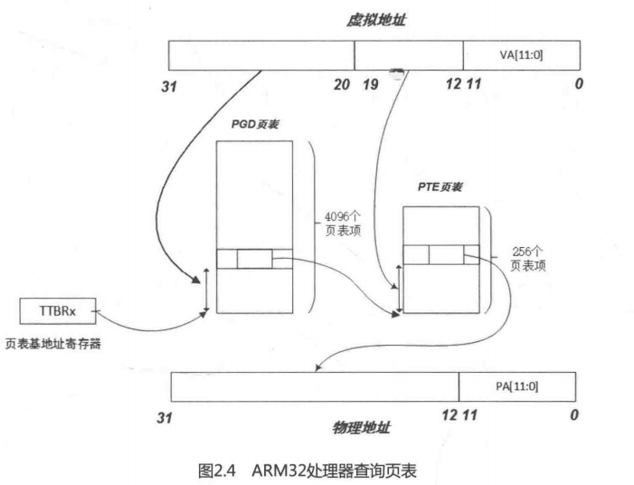

在32bit中的Linux内核中一般采用3层映射模型，第1层是页面目录（PGD)，第2层是页面中间目录（PMD）,第3层才是页面映射表（PTE）。**但在ARM32系统中只用到两层映射，因此在实际代码中就要3层映射模型中合并一层**。在ARM32架构中，可以按段（section）来映射，这时采用单层映射模式。使用页面映射需要两层映射结构，页面的选择可以是64KB的大页面或4KB的小页面，如图2.4所示。Linux内核通常使用4KB大小的小页面。



如果采用单层的段映射，内存中有一个段映射表，表中有4096个表项，每个表项的大小是4Byte，所以这个段映射表的大小是16KB，而且其位置必须与16KB边界对齐。每个段表项可以寻址1MB大小的地址空间。当CPU访问内存时，32位虚拟地址的高12位（bit[31:20]）用作访问段映射表的索引，从表中找到相应的表项。每个表项提供了一个12位的物理段地址，以及相应的标志位，如可读、可写等标志位。将这个12bit的物理地址和虚拟地址的低20bit拼凑在一起，就得到32bit的物理地址；

如果使用页面映射的方式，**段映射表就变成了一级映射表**（First Level table，在linux内核中成为PGD）,其表项提供的不再是物理段地址，而是二级页表的基地址。**32bit虚拟地址的高12bit（bit[31:20]）作为访问一级页表的索引值，找到相应的表项**，每个表项指向一个二级页表。以虚拟地址的次8bit（bit[19:12]）作为访问二级目录的索引值，得到相应的页表项，从这个页表项找到20位的物理页面地址。最后将这20bit的物理页面地址和虚拟地址的低12bit拼凑起来，得到最终的32bit物理地址。这个过程在ARM32架构中由MMU硬件完成，软件不需要介入；

```
[arch/arm/include/asm/pgtable-21level.h]
#define PMD_SHIFT	21
#define PGDIR_SHIFT	21
#define PMD_SIZE	(1UL << PMD_SHIFT)
#define PMD_MASK	(~(PMD_SIZE-1))
#define PGDIR_SIZE	(1UL << PGDIR_SHIFT)
#define PGDIR_MASK	(~(PGDIR_SIZE-1))
```

ARM32架构中一级页表PGD的偏移量应该从20bit开始，为何这里的头文件定义从21bit开始呢？

我们从ARM linux内核建立具体内存区间的页表映射过程中来看页表映射是如何实现的。crate_mapping()函数就是为一个给定内存区间建立页表映射，这个函数使用map_desc数据结构来描述一个内存区间。

```
struct map_desc {
	unsigned long virtual;	//虚拟地址的起始地址
	unsigned long pfn;		//物理地址的开始地址的页帧号
	unsigned long length;	//内存区间大小
	unsigned int type;		
}
```


