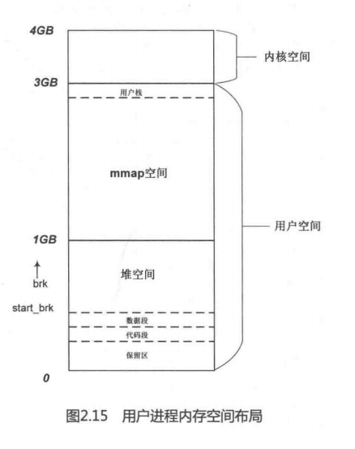

brk系统调用主要实现在mm/mmap.c函数中。

```
[mm/mmap.c]

SYSCALL_DEFINE1(brk, unsigned long, brk)
{
	unsigned long retval;
	unsigned long newbrk, oldbrk;
	struct mm_struct *mm = current->mm;
	unsigned long min_brk;
	bool populate;

	down_write(&mm->mmap_sem);

#ifdef CONFIG_COMPAT_BRK
	/*
	 * CONFIG_COMPAT_BRK can still be overridden by setting
	 * randomize_va_space to 2, which will still cause mm->start_brk
	 * to be arbitrarily shifted
	 */
	if (current->brk_randomized)
		min_brk = mm->start_brk;
	else
		min_brk = mm->end_data;
#else
	min_brk = mm->start_brk;
#endif
	if (brk < min_brk)
		goto out;

	/*
	 * Check against rlimit here. If this check is done later after the test
	 * of oldbrk with newbrk then it can escape the test and let the data
	 * segment grow beyond its set limit the in case where the limit is
	 * not page aligned -Ram Gupta
	 */
	if (check_data_rlimit(rlimit(RLIMIT_DATA), brk, mm->start_brk,
			      mm->end_data, mm->start_data))
		goto out;

	newbrk = PAGE_ALIGN(brk);
	oldbrk = PAGE_ALIGN(mm->brk);
	if (oldbrk == newbrk)
		goto set_brk;

	/* Always allow shrinking brk. */
	if (brk <= mm->brk) {
		if (!do_munmap(mm, newbrk, oldbrk-newbrk))
			goto set_brk;
		goto out;
	}

	/* Check against existing mmap mappings. */
	if (find_vma_intersection(mm, oldbrk, newbrk+PAGE_SIZE))
		goto out;

	/* Ok, looks good - let it rip. */
	if (do_brk(oldbrk, newbrk-oldbrk) != oldbrk)
		goto out;

set_brk:
	mm->brk = brk;
	populate = newbrk > oldbrk && (mm->def_flags & VM_LOCKED) != 0;
	up_write(&mm->mmap_sem);
	if (populate)
		mm_populate(oldbrk, newbrk - oldbrk);
	return brk;

out:
	retval = mm->brk;
	up_write(&mm->mmap_sem);
	return retval;
}
```



在32位Linux内核中，每个用户进程拥有3GB的虚拟空间。内核如何为用户空间来划分这3GB的虚拟空间呢？用户进程的可执行文件由代码段和数据段组成，数据段包括所有静态分配的数据空间，例如全局变量和静态局部变量等。这些空间在可执行文件装载时，内核就为其分配好这些空间，包括虚拟地址和物理页面，并建立好两者的映射关系。如图2.15所示，用户进程的用户栈从3GB虚拟空间的顶部开始，由顶向下延伸，而brk分配的空间是从数据段的顶部end_data到用户栈的底部。所以动态分配空间是从进程的end_data开始，每次分配一块空间，就把这个边界往上推进一段，同时内核和进程都会记录当前边界的位置。

第9行代码，用户进程的struct mm_struct数据结构有一个变量存放数据段的结束地址，如果brk请求的边界小于这个地址，那么请求无效。mm->brk记录动态分配区的当前底部，参数brk表示所要求的新边界，是用户进程分配内存大小与其动态分配区底部边界相加。

如果新边界小于老边界，那么表示释放空间，调用do_munmap()来释放这一部分空间的内存。

find_vma_intersection()函数以老边界oldbrk地址去查找系统中有没有一块已经存在的VMA，它通过find_vma()来查找当前用户进程中是否有一个VMA和start_addr地址有重叠。

如果find_vma_intersection()找到一块包含start_addr的VMA，说明老边界开始的地址空间已经在使用了，就不需要再寻找了。

第34行代码中do_brk()函数是这里的核心函数。

```

/*
 *  this is really a simplified "do_mmap".  it only handles
 *  anonymous maps.  eventually we may be able to do some
 *  brk-specific accounting here.
 */
static unsigned long do_brk(unsigned long addr, unsigned long len)
{
	struct mm_struct *mm = current->mm;
	struct vm_area_struct *vma, *prev;
	unsigned long flags;
	struct rb_node **rb_link, *rb_parent;
	pgoff_t pgoff = addr >> PAGE_SHIFT;
	int error;

	len = PAGE_ALIGN(len);
	if (!len)
		return addr;

	flags = VM_DATA_DEFAULT_FLAGS | VM_ACCOUNT | mm->def_flags;

	error = get_unmapped_area(NULL, addr, len, 0, MAP_FIXED);
	if (error & ~PAGE_MASK)
		return error;

	error = mlock_future_check(mm, mm->def_flags, len);
	if (error)
		return error;

	/*
	 * mm->mmap_sem is required to protect against another thread
	 * changing the mappings in case we sleep.
	 */
	verify_mm_writelocked(mm);

	/*
	 * Clear old maps.  this also does some error checking for us
	 */
 munmap_back:
	if (find_vma_links(mm, addr, addr + len, &prev, &rb_link, &rb_parent)) {
		if (do_munmap(mm, addr, len))
			return -ENOMEM;
		goto munmap_back;
	}

	/* Check against address space limits *after* clearing old maps... */
	if (!may_expand_vm(mm, len >> PAGE_SHIFT))
		return -ENOMEM;

	if (mm->map_count > sysctl_max_map_count)
		return -ENOMEM;

	if (security_vm_enough_memory_mm(mm, len >> PAGE_SHIFT))
		return -ENOMEM;

	/* Can we just expand an old private anonymous mapping? */
	vma = vma_merge(mm, prev, addr, addr + len, flags,
					NULL, NULL, pgoff, NULL);
	if (vma)
		goto out;

	/*
	 * create a vma struct for an anonymous mapping
	 */
	vma = kmem_cache_zalloc(vm_area_cachep, GFP_KERNEL);
	if (!vma) {
		vm_unacct_memory(len >> PAGE_SHIFT);
		return -ENOMEM;
	}

	INIT_LIST_HEAD(&vma->anon_vma_chain);
	vma->vm_mm = mm;
	vma->vm_start = addr;
	vma->vm_end = addr + len;
	vma->vm_pgoff = pgoff;
	vma->vm_flags = flags;
	vma->vm_page_prot = vm_get_page_prot(flags);
	vma_link(mm, vma, prev, rb_link, rb_parent);
out:
	perf_event_mmap(vma);
	mm->total_vm += len >> PAGE_SHIFT;
	if (flags & VM_LOCKED)
		mm->locked_vm += (len >> PAGE_SHIFT);
	vma->vm_flags |= VM_SOFTDIRTY;
	return addr;
}

```

在do_brk()函数中，申请分配内存大小要以页面大小对齐。

第12行代码，get_unmapped_area()函数用来判断虚拟内存空间是否有足够的空间，返回一段没有映射过的空间的起始地址，这个函数会调用到具体的体系结构中实现。

```
unsigned long
arch_get_unmapped_area_topdown(struct file *filp, const unsigned long addr0,
			const unsigned long len, const unsigned long pgoff,
			const unsigned long flags)
{
	struct vm_area_struct *vma;
	struct mm_struct *mm = current->mm;
	unsigned long addr = addr0;
	int do_align = 0;
	int aliasing = cache_is_vipt_aliasing();
	struct vm_unmapped_area_info info;

	/*
	 * We only need to do colour alignment if either the I or D
	 * caches alias.
	 */
	if (aliasing)
		do_align = filp || (flags & MAP_SHARED);

	/* requested length too big for entire address space */
	if (len > TASK_SIZE)
		return -ENOMEM;

	if (flags & MAP_FIXED) {
		if (aliasing && flags & MAP_SHARED &&
		    (addr - (pgoff << PAGE_SHIFT)) & (SHMLBA - 1))
			return -EINVAL;
		return addr;
	}

	/* requesting a specific address */
	if (addr) {
		if (do_align)
			addr = COLOUR_ALIGN(addr, pgoff);
		else
			addr = PAGE_ALIGN(addr);
		vma = find_vma(mm, addr);
		if (TASK_SIZE - len >= addr &&
				(!vma || addr + len <= vma->vm_start))
			return addr;
	}

	info.flags = VM_UNMAPPED_AREA_TOPDOWN;
	info.length = len;
	info.low_limit = FIRST_USER_ADDRESS;
	info.high_limit = mm->mmap_base;
	info.align_mask = do_align ? (PAGE_MASK & (SHMLBA - 1)) : 0;
	info.align_offset = pgoff << PAGE_SHIFT;
	addr = vm_unmapped_area(&info);

	/*
	 * A failed mmap() very likely causes application failure,
	 * so fall back to the bottom-up function here. This scenario
	 * can happen with large stack limits and large mmap()
	 * allocations.
	 */
	if (addr & ~PAGE_MASK) {
		VM_BUG_ON(addr != -ENOMEM);
		info.flags = 0;
		info.low_limit = mm->mmap_base;
		info.high_limit = TASK_SIZE;
		addr = vm_unmapped_area(&info);
	}

	return addr;
}
```

arch_get_unmapped_area_topdown()是ARM架构里get_unmapped_area()函数的实现，该函数留给读者自行阅读。

第20行代码中的find_vma_links()函数之前已经阅读过了，它循环遍历用户进程红黑树中的VMAs，然后根据addr来查找最合适的插入红黑树的节点，最终rb_link指针指向最合适节点rb_left或rb_right指针本身的地址。返回0表示查找最合适插入的节点，返回-ENOMEM表示和现有的VMA重叠，这时会调用do_munmap()函数来释放这段重叠的空间。

do_brk()函数中第37行，vma_merge()函数去找有没有可能合并addr附近的VMA。如果没办法合并，那么只能创建一个新的VMA，VMA的地址空间就是[addr, addr+len]。

第53行代码，新创建的VMA需要加入到mm->mmap链表和红黑树中，vma_link()函数实现这个功能，该函数之前已经阅读过了。

回到brk函数中，第39行代码，这里判断flags是否置位VM_LOCKED，这个VM_LOCKED通常从mlockall系统调用中设置而来。如果有，那么调用mm_populate()马上分配物理内存并建立映射。通常用户程序很少使用VM_LOCKED分配掩码。所以brk不会为这个用户进程立马分配物理页面，而是一直将分配物理页面的工作推延到用户进程需要访问这些虚拟页面，发生了缺页中断才会分配物理内存，并和虚拟地址建立映射关系。


